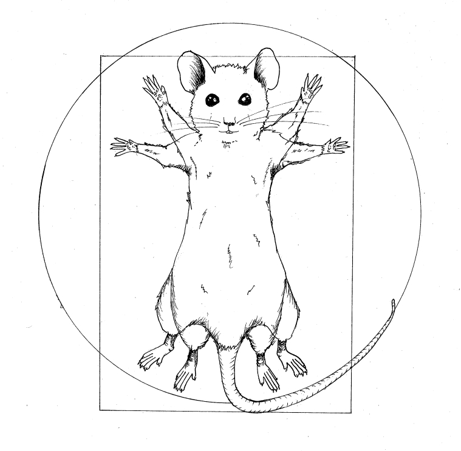

```{r, include=FALSE}
knitr::opts_chunk$set(echo = FALSE,
                      warning = FALSE,
                      tidy = FALSE,
                      message = FALSE,
                      fig.align = 'center',
                      out.width = "100%")
options(knitr.table.format = "html") 
```

# Introduction

```{r vitruvian}

```

Systems genetics studies in model organisms have informed our understanding of biology and disease processes. 
Multiparental crosses of more than two founders incorporate greater levels of genetic diversity than two-parent crosses.
Two widely used mouse resources are the Collaborative Cross and Diversity Outbred mice. 
Collaborative Cross includes approximately 60 inbred mouse lines, each of which incorporates DNA from eight founder lines.
Diversity Outbred mice are outbred, highly heterozygous, and are genetic mosaics of the same eight founders.
Quantitative trait locus (QTL) mapping studies have identified genetic loci affecting diverse traits, including phenotypes related to immune responses to *M. tuberculosis* infection, in Diversity Outbred and Collaborative Cross mice. 


```{r, include=FALSE}
knitr::write_bib(c('posterdown', 'rmarkdown','pagedown'), 'packages.bib')
```

```{r mpp, eval = TRUE, echo = FALSE, out.height=400, out.width="65%"}
##############################
# HS (light background)
# from kbroman/QTLfigs on github
##############################

n.lines <- 80

bgcolor <- "white"
color <- qtl2::CCcolors

#pdf("Figs/hs_light.pdf", width=9.75, height=6.5, pointsize=16, onefile=TRUE)
par(mar=rep(0.1,4),las=1,fg="black",col="black",col.axis="black",col.lab="black",
    bg=bgcolor, bty="n")
plot(0,0,xlim=c(0,864),ylim=c(25,480),xaxt="n",yaxt="n",xlab="",ylab="",type="n")

u <- par("usr")
text(u[1],460,expression(G[0]),adj=c(0,0.5))

xloc <- 10
yloc <- 480
for(i in 1:8) {
  rect(xloc,yloc,xloc+8,yloc-40,col=color[i],border=color[i], lend=1, ljoin=1)
  rect(xloc+20,yloc,xloc+28,yloc-40,col=color[i],border=color[i], lend=1, ljoin=1)
  text(xloc+14,yloc-50,LETTERS[i],adj=c(0.5,1))

  xloc <- xloc+38+35+46
}

set.seed(11716365)
source(here::here("R/meiosis_func.R"))
gen <- vector("list", n.lines)
for(i in 1:n.lines)
  gen[[i]] <- create.par(100, sample(1:8, 2))
wh <- seq(1, n.lines, by=5)

xloc <- 10
yloc <- yloc - 80
for(i in 1:15) {
  g <- c(gen[[wh[i]]][[1]][2,1], gen[[wh[i]]][[2]][2,1])
  rect(xloc,yloc,xloc+8,yloc-40,col=color[g[1]],border=color[g[1]], lend=1, ljoin=1)
  rect(xloc+20,yloc,xloc+28,yloc-40,col=color[g[2]],border=color[g[2]], lend=1, ljoin=1)

  xloc <- xloc+(38+35+46)/2
}
text(u[1],yloc-20,expression(G[1]),adj=c(0,0.5))

mysample <- function(n)
  as.numeric(t(apply(matrix(1:n, ncol=2, byrow=TRUE), 2, sample)))

old <- gen[mysample(n.lines)]
for(i in 1:(n.lines/2)) {
  gen[[i*2-1]] <- cross(old[[i*2-1]], old[[i*2]])
  gen[[i*2]] <- cross(old[[i*2-1]], old[[i*2]])
}

xloc <- 10
yloc <- yloc - 80
for(i in 1:15) {
  thegen <- gen[[wh[i]]]
  g <- c(thegen[[1]][2,1], thegen[[2]][2,1])

  rect(xloc,yloc,xloc+8,yloc-40,col=color[g[1]],border=color[g[1]], lend=1, ljoin=1)
  rect(xloc+20,yloc,xloc+28,yloc-40,col=color[g[2]],border=color[g[2]], lend=1, ljoin=1)

  mult <- 40/thegen[[1]][1,ncol(thegen[[1]])]
  xxloc <- c(xloc, xloc+20)
  for(k in 1:2) {
    temp <- thegen[[k]]
    for(j in 2:ncol(temp)) {
      rect(xxloc[k],yloc-40+temp[1,j]*mult,xxloc[k]+8,yloc-40+temp[1,j-1]*mult,
           col=color[temp[2,j]],border=color[temp[2,j]], lend=1, ljoin=1)
    }
  }

  xloc <- xloc+(38+35+46)/2
}
text(u[1],yloc-20,expression(G[2]),adj=c(0,0.5))


for(kk in 3:10) {
  old <- gen[mysample(n.lines)]
  for(i in 1:(n.lines/2)) {
    gen[[i*2-1]] <- cross(old[[i*2-1]], old[[i*2]])
    gen[[i*2]] <- cross(old[[i*2-1]], old[[i*2]])
  }
}

xloc <- 10
yloc <- yloc - 80
for(i in 1:15) {
  thegen <- gen[[wh[i]]]
  g <- c(thegen[[1]][2,1], thegen[[2]][2,1])

  rect(xloc,yloc,xloc+8,yloc-40,col=color[g[1]],border=color[g[1]], lend=1, ljoin=1)
  rect(xloc+20,yloc,xloc+28,yloc-40,col=color[g[2]],border=color[g[2]], lend=1, ljoin=1)

  mult <- 40/thegen[[1]][1,ncol(thegen[[1]])]
  xxloc <- c(xloc, xloc+20)
  for(k in 1:2) {
    temp <- thegen[[k]]
    for(j in 2:ncol(temp)) {
      rect(xxloc[k],yloc-40+temp[1,j]*mult,xxloc[k]+8,yloc-40+temp[1,j-1]*mult,
           col=color[temp[2,j]],border=color[temp[2,j]], lend=1, ljoin=1)
    }
  }

  xloc <- xloc+(38+35+46)/2
}
text(u[1],yloc-20,expression(G[10]),adj=c(0,0.5))


for(kk in 11:15) {
  old <- gen[mysample(n.lines)]
  for(i in 1:(n.lines/2)) {
    gen[[i*2-1]] <- cross(old[[i*2-1]], old[[i*2]])
    gen[[i*2]] <- cross(old[[i*2-1]], old[[i*2]])
  }
}

xloc <- 10
yloc <- yloc - 80
for(i in 1:15) {
  thegen <- gen[[wh[i]]]
  g <- c(thegen[[1]][2,1], thegen[[2]][2,1])

  rect(xloc,yloc,xloc+8,yloc-40,col=color[g[1]],border=color[g[1]], lend=1, ljoin=1)
  rect(xloc+20,yloc,xloc+28,yloc-40,col=color[g[2]],border=color[g[2]], lend=1, ljoin=1)

  mult <- 40/thegen[[1]][1,ncol(thegen[[1]])]
  xxloc <- c(xloc, xloc+20)
  for(k in 1:2) {
    temp <- thegen[[k]]
    for(j in 2:ncol(temp)) {
      rect(xxloc[k],yloc-40+temp[1,j]*mult,xxloc[k]+8,yloc-40+temp[1,j-1]*mult,
           col=color[temp[2,j]],border=color[temp[2,j]], lend=1, ljoin=1)
    }
  }

  xloc <- xloc+(38+35+46)/2
}
text(u[1],yloc-20,expression(G[15]),adj=c(0,0.5))

for(kk in 16:20) {
  old <- gen[mysample(n.lines)]
  for(i in 1:(n.lines/2)) {
    gen[[i*2-1]] <- cross(old[[i*2-1]], old[[i*2]])
    gen[[i*2]] <- cross(old[[i*2-1]], old[[i*2]])
  }
}

xloc <- 10
yloc <- yloc - 80
for(i in 1:15) {
  thegen <- gen[[wh[i]]]
  g <- c(thegen[[1]][2,1], thegen[[2]][2,1])

  rect(xloc,yloc,xloc+8,yloc-40,col=color[g[1]],border=color[g[1]], lend=1, ljoin=1)
  rect(xloc+20,yloc,xloc+28,yloc-40,col=color[g[2]],border=color[g[2]], lend=1, ljoin=1)

  mult <- 40/thegen[[1]][1,ncol(thegen[[1]])]
  xxloc <- c(xloc, xloc+20)
  for(k in 1:2) {
    temp <- thegen[[k]]
    for(j in 2:ncol(temp)) {
      rect(xxloc[k],yloc-40+temp[1,j]*mult,xxloc[k]+8,yloc-40+temp[1,j-1]*mult,
           col=color[temp[2,j]],border=color[temp[2,j]], lend=1, ljoin=1)
    }
  }

  xloc <- xloc+(38+35+46)/2
}
text(u[1],yloc-20,expression(G[20]),adj=c(0,0.5))

```


## Objectives

1. Traditional QTL mapping in Diversity Outbred mice [@broman2019r]
2. Infer allelic series at QTL [@crouse2018timbr]
3. QTL mapping, informed by allelic series, of traits in Collaborative Cross mice

# Methods

Widely used statistical models in QTL mapping in multiparental populations allow for each founder haplotype to have its own effect on trait values [@broman2019r].

$$
Y = x_1\beta_1 + x_2\beta_2 + x_3\beta_3 + x_4\beta_4 + \\
x_5\beta_5 + x_6\beta_6 + x_7\beta_7 + x_8\beta_8 + \epsilon
$$

However, many QTL have fewer than eight alleles in the Diversity Outbred and Collaborative Cross. Allelic series tells us the number of alleles and which founder haplotypes have which alleles. 

If a QTL in Diversity Outbred or Collaborative Cross mice has only three alleles, we may model its trait as:

$$
Y = p_1\beta_1 + p_2\beta_2 + p_3\beta_3 + \epsilon
$$


# Results

Here you may have some figures to show off, bellow I have made a scatterplot with the infamous Iris dataset and I can even reference to the figure automatically like this, `Figure \@ref(fig:irisfigure)`, Figure \@ref(fig:irisfigure).

```{r, irisfigure, fig.cap='Here is a caption for the figure. This can be added by using the "fig.cap" option in the r code chunk options, see this [link](https://yihui.name/knitr/options/#plots) from the legend himself, [Yihui Xie](https://twitter.com/xieyihui).', out.width="80%"}
par(mar=c(2,2,0,1))
plot(x = iris$Sepal.Length, y = iris$Sepal.Width,
     col = iris$Species, pch = 19, xlab = "Sepal Length",
     ylab = "Sepal Width")
```

Maybe you want to show off some of that fancy code you spent so much time on to make that figure, well you can do that too! Just use the `echo=TRUE` option in the r code chunk options, Figure \@ref(fig:myprettycode)!

```{r myprettycode, echo=TRUE, fig.cap='Boxplots, so hot right now!', fig.height=6, out.width="80%"}
#trim whitespace
par(mar=c(2,2,0,0))
#plot boxplots
boxplot(iris$Sepal.Width~iris$Species,
        col = "#008080", 
        border = "#0b4545",
        ylab = "Sepal Width (cm)",
        xlab = "Species")
```

How about a neat table of data? See, Table \@ref(tab:iristable):

```{r, iristable}
knitr::kable(
  iris[1:15,1:5], format = "html",
  caption = "A table made with the **knitr::kable** function.",
  align = "c", col.names = c("Sepal <br> Length",
                             "Sepal <br> Width",
                             "Petal <br> Length",
                             "Petal <br> Width",
                             "Species"),
  escape = FALSE)
```

# References

