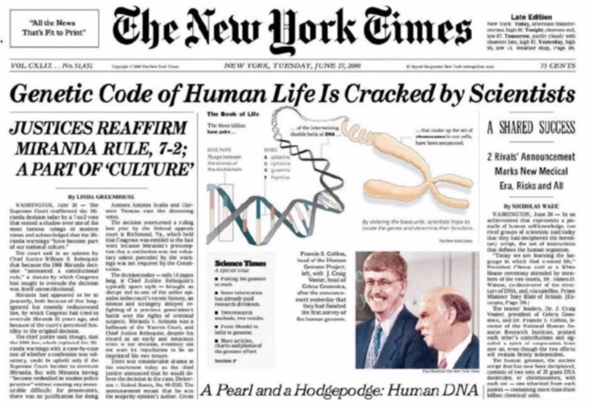
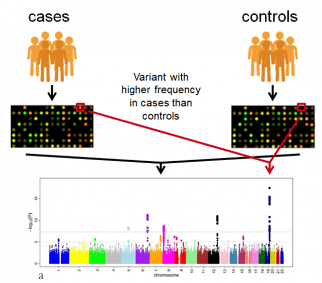
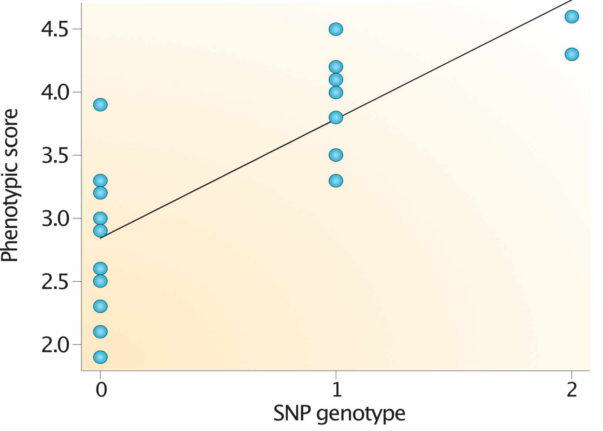
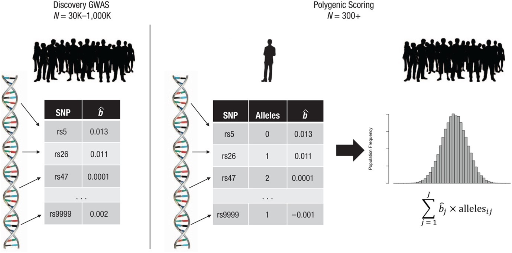
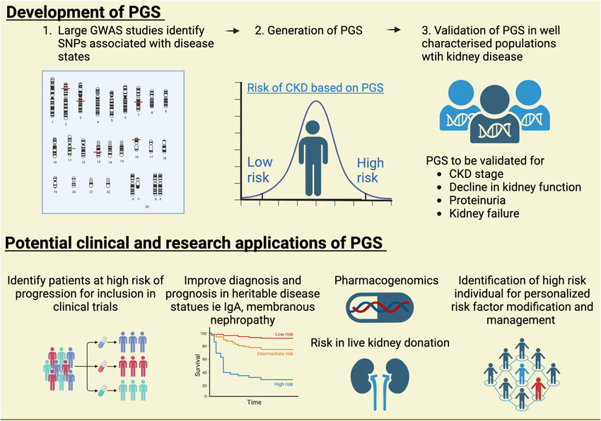
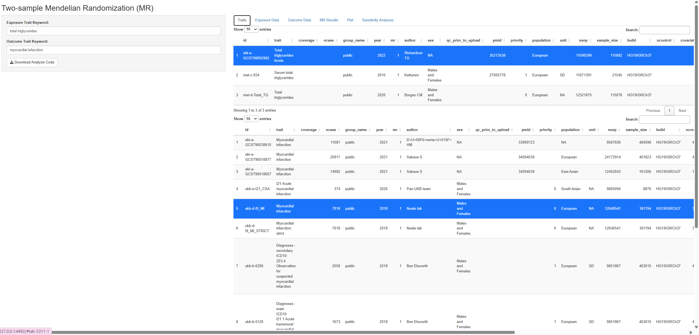
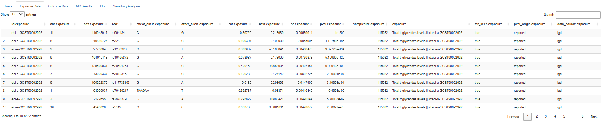
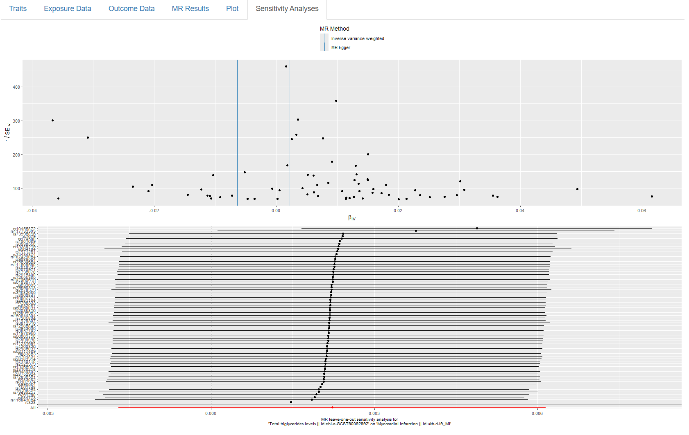
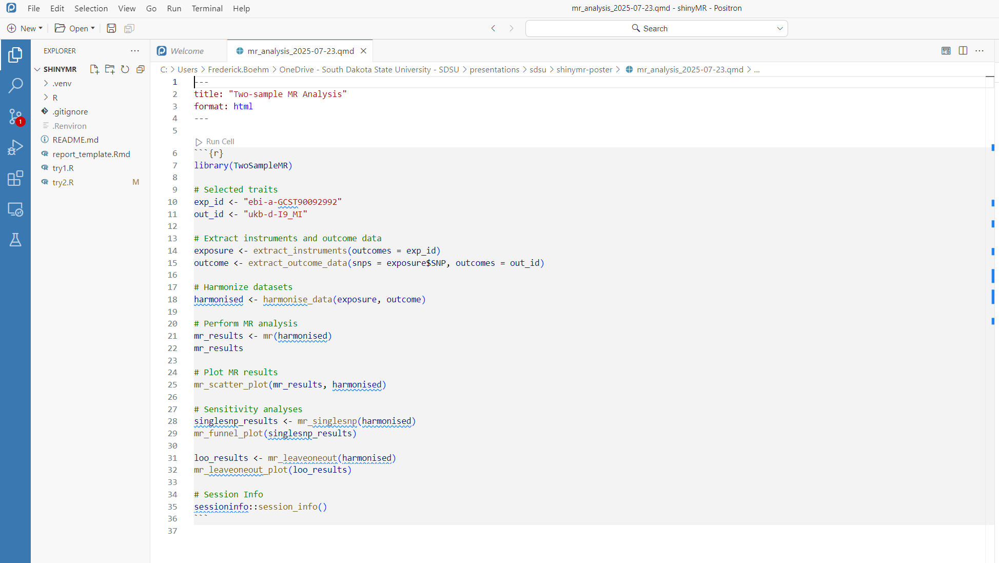
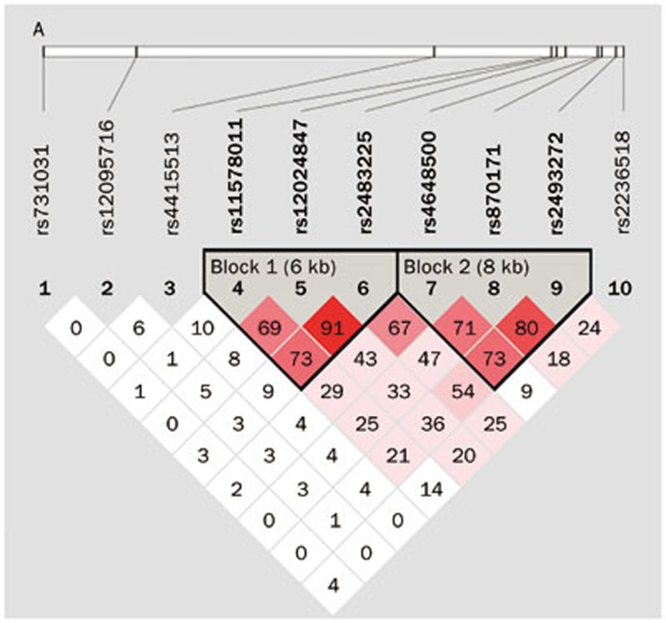

# Biography

## Current

- Assistant professor of statistics at South Dakota State University  
- Started in August 2024  
- Research: Statistical genetics and public health  
- Teaching: Statistical methods, time series analysis, ...  


## Training

- Postdoctoral researcher at U. Michigan and U. Massachusetts Medical School (2019 to 2024)  
    - Statistical methods for human genetics studies  

- Ph.D. (2019) in statistics, U. Wisconsin-Madison  
    - Statistical methods for mouse genetics studies    

- Post-MD researcher, U. Washington (2007 to 2010)  
    - Statistical methods for genome-wide association studies  

- M.D. (2007), U. Wisconsin-Madison  

- B.S. (2001) in chemistry, mathematics, and biochemistry, U. Wisconsin-Madison  


# Human Genetics and Genome-wide Association Studies 

## Human Genetics Goals

- Understand genetic contributions to complex traits (quantitative and disease traits)  
- Mapping the human genome (1990s to early 2000s) enabled high-throughput genotyping chips and genome-wide association studies




## What is a SNP?

  <!-- https://www.genome.gov/genetics-glossary/Single-Nucleotide-Polymorphisms-SNPs -->


## Genome-wide Association Studies  




## Genome-wide Association Studies 

- Subjects are both genotyped at ~ 1 million SNPs across the genome and phenotyped for a complex trait or disease of interest  
- Test marginal effects of each individual SNP on the trait of interest using, *eg.*, linear regression  

$$ y = g\beta + \text{Covariates} + \epsilon $$


## Genome-wide Association Studies 

{.absolute width=800 height=500} 


## Genome-wide Association Studies  


- GWAS results per SNP are publicly shared   


# Post-GWAS Analyses  

## Overview 

- Many recent statistical methods use GWAS results to:  
    - Assess genetic risk of disease (via polygenic scores)  
    - Quantify genetic correlation between two traits (via linkage disequilibrium score regression)  
    - Infer causal relationships between two traits  (via Mendelian randomization)  

## GWAS Summary Data

```{r}
#| echo: false
fn <- "head.tsv"
fn |> vroom::vroom() |> head(n = 3) |> dplyr::select(chromosome:variant_id) |> gt::gt() |> gt::opt_table_font(size = 16)
```

## Polygenic Scores

{.absolute width=800 height=500}


## Polygenic Scores 

- Summarize a person's genetic risk for a disease  
- Can impact disease risk similar to monogenic mutations  
- Weighted sum of risk alleles  

$$PGS_j = \sum_i w_i g_{ij}$$

- Methods differ in how they assign weights, $w_i$   


## Polygenic Scores

- Clumping and thresholding: 
    - Uses only strongly associated SNPs  
    - Marginal effects are the weights (for strongly associated SNPs)    
 
$$ PGS_j = \sum_i \hat\beta_i g_{ij} $$


## Polygenic Scores & Clinical Applications




# ShinyMR Overview

## Collaborative Research with Ji Hoon Park (SDSU) 


{.nostretch fig-align="center" width="200px"}


## What is Mendelian Randomization? {.nostretch} 

{.nostretch fig-align="center" width="800px"}


- Instrumental variable analysis to characterize evidence for a causal effect of the "exposure" (X) on the "outcome" (Y)   


<!-- insert causal diagram: https://en.wikipedia.org/wiki/Mendelian_randomization#/media/File:Directed_acylic_graph_for_Mendelian_randomization_Wikipedia_page.png -->


## Motivation for a Shiny App


- Many recent reports have questioned the scientific rigor of published MR studies  
- To promote rigor and reproducibility, shinyMR users automatically perform MR analysis and sensitivity analyses to evaluate the robustness of MR assumptions    


## What is Shiny? 


- An R package that enables users to build an interactive webpage "App"  
- App can then be deployed on a website for other scientists to use  


## Shiny App Design Considerations 


- Interface with openGWAS database  
- Require sensitivity analyses to assess MR assumptions  
- Users must manually ensure that there is no subject overlap in the two GWAS  


# Development version of the app


## Choosing GWASs from OpenGWAS Database




## Extract SNP instruments  




## Perform MR analysis


## Perform sensitivity analyses  




## Download a reproducible quarto document  




# Open Research Questions


## Overview of Open Questions

1. Statistical properties of PGS  
2. Clinical applications & translations for PGS  
3. Transferability among populations & Equity of Applying PGS  


## Uncertainty in PGS

- Each person's PGS is a data-derived statistic and has a probability distribution 

$$PGS_j = \sum_i w_i g_{ij}$$

- Typically, only the point prediction is used in PGS applications  

## Uncertainty in PGS


- Example application is to administer an intervention to those with high PGS  
- Variability in PGS is underappreciated, yet it can influence who gets classified as "high risk"  


## LD Matrix in PGS  

- Many PGS methods require a LD matrix input to characterize the correlation among SNP genotypes  
- LD matrices are typically not shared from GWAS  
- LD reference panel is used to approximate the true LD matrix from the GWAS 




## Thank you!

Fred Boehm (<Frederick.Boehm@sdstate.edu>)

