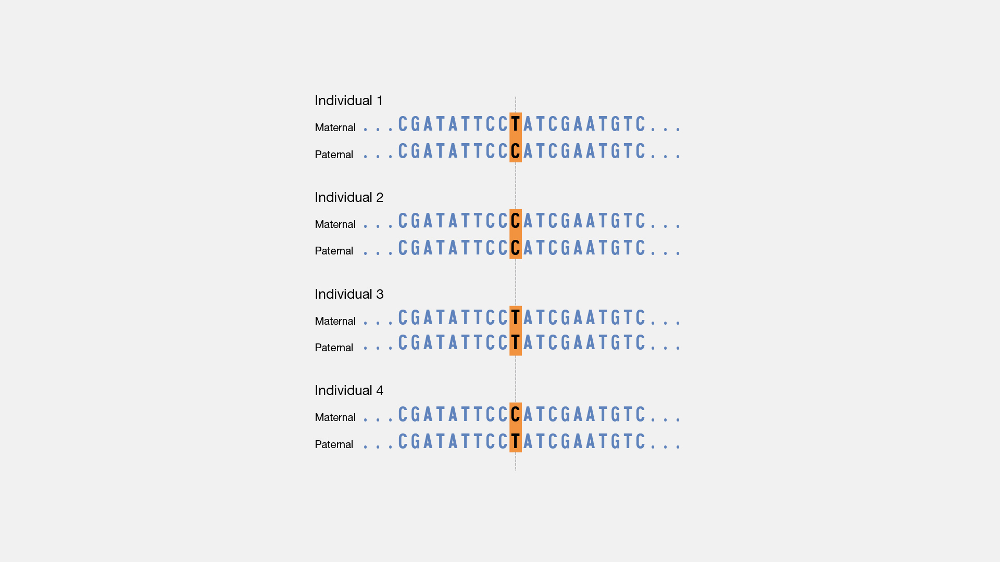
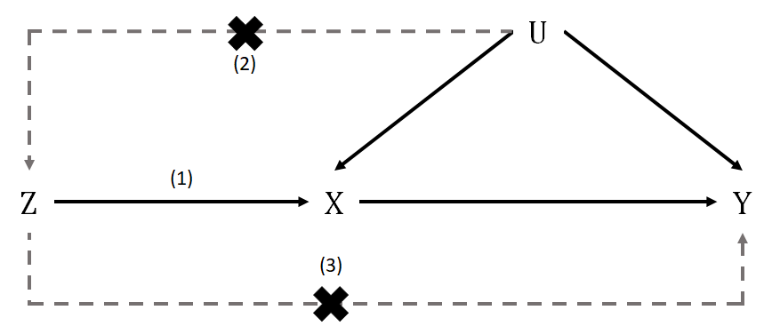
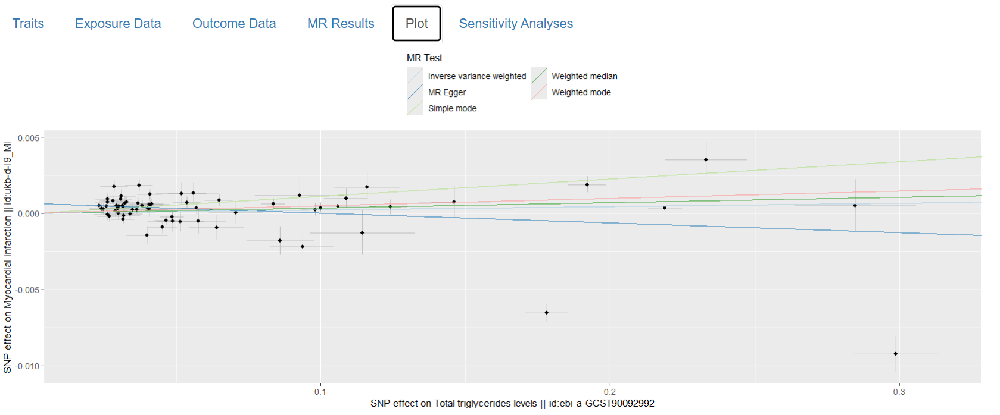

## Why Do Some People Get Sick and Others Don't?

- Our DNA differs at millions of positions called **SNPs** (single-nucleotide polymorphisms)
- These small differences influence risk for diseases like heart disease, diabetes, and cancer

## Genome-Wide Association Studies (GWAS)

- Genotype thousands of people and look for SNPs linked to a disease or trait
- Each point on the plot is one SNP; peaks indicate a potential genetic risk factor
- GWAS results are shared publicly — enabling many downstream analyses

## Polygenic Scores: Personalized Genetic Risk

- A **polygenic score** combines thousands of small genetic effects into a single risk number for each person
- Useful for identifying individuals at elevated risk *before* symptoms appear

$$PGS_j = \sum_i w_i \, g_{ij}$$

{fig-align="center" width="600px"}

## Mendelian Randomization: Cause or Coincidence?

- Does high LDL cholesterol *cause* heart disease, or do they just co-occur?
- **Mendelian randomization** uses genetic variants as natural experiments to answer causal questions — without running a clinical trial

{fig-align="center" width="750px"}

## shinyMR: Rigorous Analysis for All Researchers

- Many published Mendelian randomization studies lack rigorous sensitivity analyses
- **shinyMR** is a free, web-based app (built with R Shiny) that guides researchers through best-practice analyses and produces a reproducible report

{fig-align="center" width="700px"}

**Future directions:** uncertainty quantification in polygenic scores; equity of genetic risk prediction across ancestries

## Thank You

**Fred Boehm**  
Assistant Professor of Statistics  
South Dakota State University  
<Frederick.Boehm@sdstate.edu>  

*Questions?*