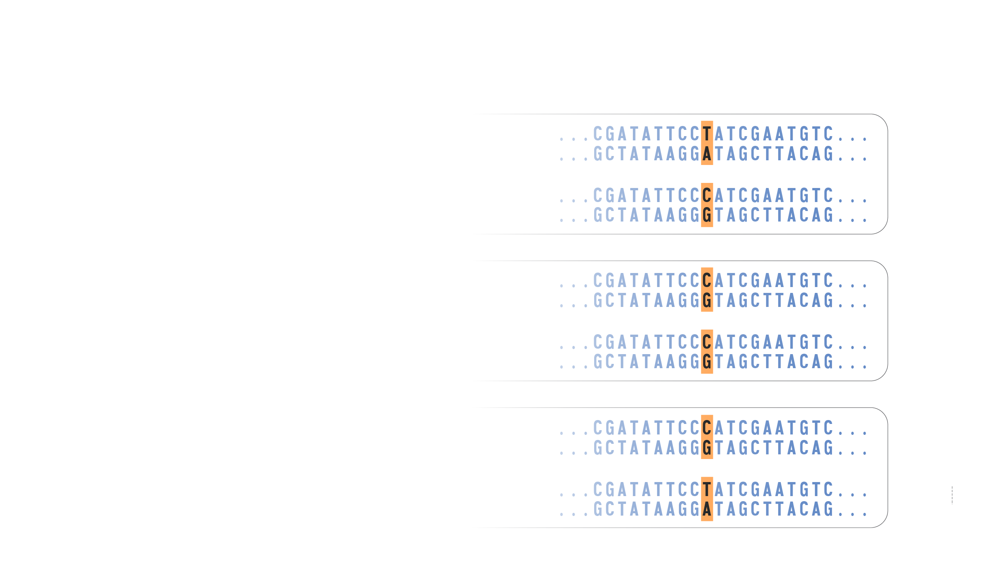
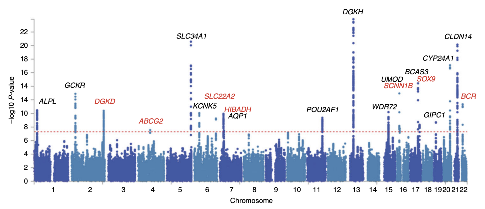
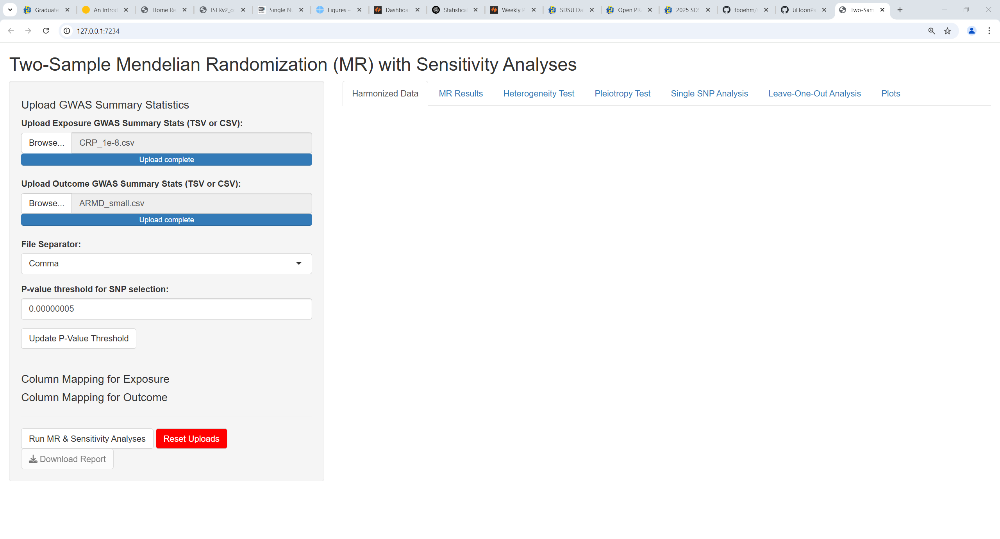

## Collaborative Research with Ji Hoon Park  

{.nostretch fig-align="center" width="200px"}

## What is a SNP?

  <!-- https://www.genome.gov/genetics-glossary/Single-Nucleotide-Polymorphisms-SNPs -->

## Genome-wide association studies

- A study to detect genotype-phenotype associations   
- Involves thousands of subjects with SNP genotypes and phenotypes  
- GWAS results per SNP are publicly shared    

<!-- insert data structure printed here for my example data -->

## What is Mendelian Randomization? {.nostretch} 

{.nostretch fig-align="center" width="800px"}

- Instrumental variable analysis to characterize evidence for a causal effect of the "exposure" (X) on the "outcome" (Y)   

<!-- insert causal diagram: https://en.wikipedia.org/wiki/Mendelian_randomization#/media/File:Directed_acylic_graph_for_Mendelian_randomization_Wikipedia_page.png -->

## What is Shiny? 

- An R package that enables users to build an interactive webpage "App"  
- App can then be deployed on a website for other scientists to use  

## Motivation for a Shiny App

- Many recent reports have questioned the scientific rigor of published MR studies  
- To promote rigor and reproducibility, users can download R code to perform their MR analyses  

## Shiny App Design Considerations 

- Users upload GWAS summary files & assign standardized column names    
- Require sensitivity analyses to assess MR assumptions  
- Users must manually ensure that there is no subject overlap in the two GWAS  

## Development version of the app

## Thank you!

