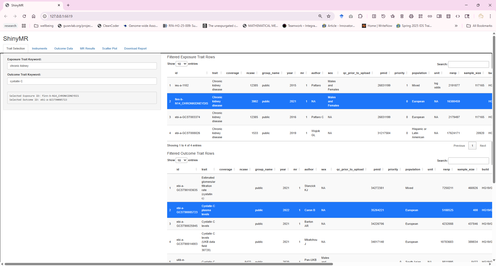
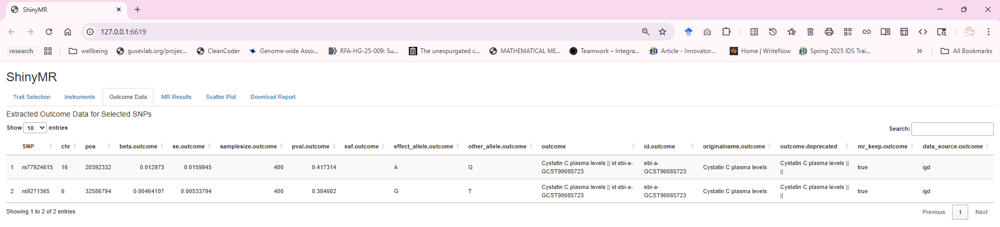
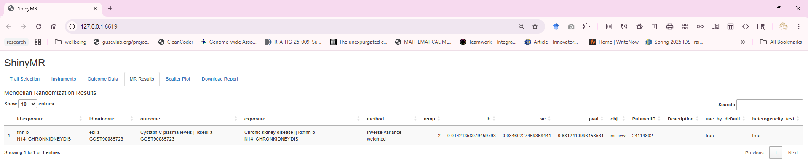

<!-- 
https://stackoverflow.com/questions/76643394/add-background-colour-to-text-column-in-quarto
-->

:::: {.grid}

::: {.g-col-2 .col-outer}

## Problem statement

- Two-Sample MR is widely used with GWAS summary statistics like those in the OpenGWAS database and the GWAS Catalog [@davey2003mendelian;@hartwig2016two].  
- Ease of data access has fueled proliferation of MR studies that lack rigor and may provide misleading results [@lu2025no;@elsworth2020mrc;@macarthur2017new].  
- We developed ShinyMR (<https://github.com/fboehm/shinyMR>) to combat this problem.

## User interface

:::

::: {.g-col-4 .col-middle}

# ShinyMR provides a reproducible Rmarkdown file for primary MR analysis and sensitivity analyses to guide assessments of biases due to assumption violations

:::

::: {.g-col-2 .col-outer}

## References

::: {#refs}
:::

## Contact

Fred Boehm  
[Frederick.Boehm@sdstate.edu](mailto:Frederick.Boehm@sdstate.edu)  
South Dakota State University   
<https://github.com/fboehm/shinyMR>  

:::

::::
