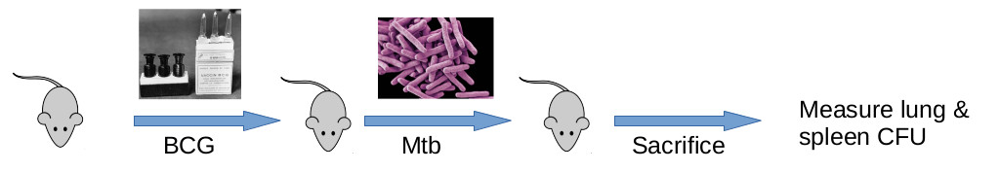
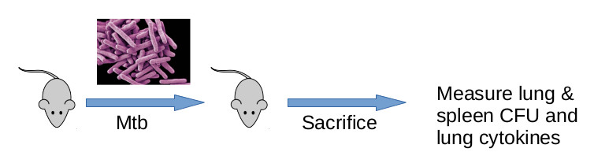

```{r, setup, include=FALSE}
knitr::opts_chunk$set(echo = FALSE,
                      warning = FALSE,
                      tidy = FALSE,
                      message = FALSE,
                      fig.align = 'center',
                      out.width = "100%")
options(knitr.table.format = "html") 
```


# Introduction

- We examined Mtb-related traits in both a Colllaborative Cross cohort (52 lines) and a Diversity Outbred cohort (763 mice)  
- In CC and DO QTL mapping, we typically work with 8 founder allele probabilities

$${Trait} = p_{A}b_A +  
p_{B}b_B +
p_{C}b_C + \\
p_{D}b_D +
p_{E}b_E +
p_{F}b_F + \\
p_{G}b_G +
p_{H}b_H + 
\epsilon$$

- Crouse and Valdar (personal communication) developed a method for inferring 
the allelic series at a QTL
- In DO and CC, some QTL have fewer than 8 alleles
- Using this fact in our QTL scans may enhance QTL detection [@jansen2003mapping]  


## Objectives

1. Infer QTL allelic series in CC mice
1. Use CC QTL allelic series to inform QTL mapping in DO mice

# Methods

```{r, fig.cap="Experimental design in DO mice"}

```

```{r, fig.cap="Experimental design in CC mice"}

```

- We mapped QTL in CC cohort with standard methods [@broman2019r]

- We used Tree-based Inference of Multi-allelism with Bayesian Regression (TIMBR) [@crouse2018timbr] to infer allelic series at CC QTL

- For each CC QTL, we scanned the DO cohort with reduced models that reflected the CC QTL allelic series

    - Example of reducing a model with inferred allelic series  
    For the allelic series: 0,1,1,0,2,1,0,0:
    1. Set $p_0 = p_A + p_D + p_G + p_H$,  
    $p_1 = p_B + p_C + p_F$,  
    $p_2 = p_E$  
    2. Use model $$Y = \beta_0p_0 + \beta_1 p_1 + \beta_2p_2 + \epsilon$$ in QTL scan


# Results

```{r, loading, echo = FALSE}
load("~/work/research/qtl2tb/analysis/data/derived_data/fda_qtl_input.Rdata")
library(magrittr)
# read s1perms for CC traits
cc_s1perm_out <- readRDS("~/work/research/qtl2tb/analysis/data/derived_data/cc_s1perm_out.rds")
bfn <-  "~/work/research/qtl2tb/analysis/data/derived_data/cc-timbr-clinical-M1-with-reduced-peaks-cis.rds"
t4 <- tibble::as_tibble(readRDS(bfn)) %>%
  dplyr::mutate(chr = as.numeric(as.character(chr))) %>%
  dplyr::select(1:3, pos_Mb, lod, 4, 6:12, 14:15) %>%
  dplyr::rename(pos = pos_Mb) %>%
  dplyr::mutate(pvalue = purrr::map2_dbl(.x = lodcolumn, .y = lod, .f = function(x, y){
    maxlods <- cc_s1perm_out[, colnames(cc_s1perm_out) == x]
    mean(maxlods >= y)
  })) %>%
  dplyr::filter(pvalue < 0.37)
  

```


1. Traditional QTL mapping in CC identified 14 suggestive peaks   
1. For each CC QTL, we:  
    1. inferred allelic series
    1. fitted reduced linear models (informed by allelic series) for QTL detection in DO
    1. identified any proximal DO QTL with LOD greater than 3


```{r, gt, echo = FALSE}
rownum <- 14
t4$cis_peaks[[rownum]] %>%
  tibble::as_tibble() %>%
  dplyr::mutate(chr = as.numeric(as.character(chr))) %>%
  dplyr::bind_rows(t4[rownum, 1:5]) %>%
  dplyr::mutate(cohort = c("DO", "CC")) %>%
  dplyr::mutate(trait = c("Spleen CFU in DO", "VEGF in CC")) %>%
  dplyr::select(-1, -2) %>%
  dplyr::select(trait, cohort, chr, pos, lod) %>%
  dplyr::arrange(pos) %>% 
  gt::gt() %>%
  gt::tab_style(
    style = gt::cell_text(size = "xx-large"), 
    locations = gt::cells_title()
    ) %>%
  gt::tab_style(
    style = gt::cell_text(size = "x-large"), 
    locations = gt::cells_column_labels(columns = TRUE)
    ) %>%
  gt::tab_style(
    style = gt::cell_text(size = "x-large", color = "blue"), 
    locations = gt::cells_body()
    ) %>%
  gt::tab_header(title = "QTL peaks on Chr 4") %>%
  gt::fmt_number(columns = dplyr::vars(pos, lod))
```


# Future research

1. Determine DO QTL p-values with approximate permutation tests [@churchill1994empirical]  
1. Consider multiple allelic series per CC QTL  


    
    


# Image credits

https://webcomicms.net/clipart-10020867-pictures-cartoon-mouse

https://www.latimes.com/science/story/2020-04-13/old-vaccines-for-other-germs-being-tested-against-the-new-coronavirus

https://www.lshtm.ac.uk/research/research-action/features/ending-tb-race-control-disease-hiding

Vitruvian Mouse by Eleni Jaecklein

# References

