```{r setup, include=FALSE}
options(htmltools.dir.version = FALSE)
knitr::opts_chunk$set(
  fig.width=9, fig.height=3.5, fig.retina=3,
  out.width = "100%",
  cache = FALSE,
  echo = FALSE,
  message = FALSE, 
  warning = FALSE,
  hiline = TRUE
)
```

```{r xaringan-themer, include=FALSE, warning=FALSE}
library(xaringanthemer)
style_duo_accent(
  primary_color = "#1381B0",
  secondary_color = "#FF961C",
  inverse_header_color = "#FFFFFF"
)
```

```{r, load_refs, include=FALSE, cache=FALSE}
library(RefManageR)
BibOptions(check.entries = FALSE,
           bib.style = "authoryear",
           cite.style = "alphabetic",
           style = "markdown",
           hyperlink = FALSE,
           dashed = FALSE)
myBib <- ReadBib("../zhou-lab-March-2022/polygenic.bib", check = FALSE)
```


class: center middle


# Prediction intervals for PGS


---

## Existing approaches to prediction intervals in PRS

1. Mondrian cross-conformal prediction intervals for PRS `r Citep(myBib, "sun_translating_2021")`
  - One approach to conformal prediction 
1. Bayesian credible intervals for PRS `r Citep(myBib, "ding_large_2021")`
  - ldpred2 used to obtain posterior samples
  - Observe large variances in PRS

---

## Importance of prediction intervals for PGS

- Clinical utility of an interval estimate in addition to point estimate
- Large variability in PRS with ldpred2 


---

class: center middle


# Methods

---

## Individual PRS uncertainty


$$y_i = x_i^T\beta + \epsilon$$

$$\epsilon_i \sim N(0, \sigma^2_e)$$

$$GV_i = x_i^T\beta$$

$$\widehat{PRS}_i = x_i^T\hat \beta$$


---

## Estimating individual uncertainty in Bayesian PRS models

- LDpred2 assumes:

$$\beta_j \sim 
\begin{cases}
    N(0, \frac{h^2_g}{Mp_{causal}}),& \text{with probability } p_{causal}\\
    0,              & \text{with probability } 1 - p_{causal}
\end{cases}$$

- $\hat\beta_{GWAS}$: marginal effects from GWAS samples
- $\hat R$: LD matrix from GWAS samples

- LDpred2 uses MCMC to sample from the posterior distribution:

$$p(\beta | \hat\beta_{GWAS}, \hat R, h_g^2, p_{causal})$$

---

## Estimating individual uncertainty in Bayesian PRS models

- Use posterior samples to construct a level $\rho$ credible interval for $GV_i$ for each subject
- For $B$ posterior samples, choose the $\frac{1 - \rho}{2}$ and $\frac{1 + \rho}{2}$ quantiles of $x_i^T\tilde \beta$ as the credible interval

---

## PRS uncertainty analytical form under infinitesimal model

- Assuming all $M$ SNPs are independent & causal, and effect sizes are iid draws from $N(0, \frac{h_g^2}{M})$:

$$\hat\beta_{GWAS, j} \sim N\left(\beta_j, \frac{1}{N}\left(1 - \frac{h_g^2}{M}\right)\right)$$
and 

$$\mathbb{E}\left(var(x_i^T\beta | x_i, X, y, h^2_g) \right) \approx \left(\frac{1}{h_g^2} + \frac{N}{M} \right)^{-1}$$

---

## Simulations

- Start with UKB genotypes  
- After SNP filtering, 459,792 SNPs remained  
- 291,273 white British individuals after filtering

$$\beta_j \sim 
\begin{cases}
    N(0, \frac{h^2_g}{Mp_{causal}}),& \text{with probability } p_{causal}\\
    0,              & \text{with probability } 1 - p_{causal}
\end{cases}$$

$$(y_1, \ldots, y_N) \sim N(X\beta, (1-h_g^2)I_N)$$

---

## 20 Parameter settings for simulations

- $h_g^2$: 0.05, 0.1, 0.25, 0.5, 0.8  
- $p_{causal}$: 0.001, 0.01, 0.1, 1  
- 10 traits per setting  
- training set: 250,000  
- validation set: 20,000  
- test set: 21,273  


---

class: center middle

# Results


---

## LD and finite GWAS sample size introduce uncertainty into PRS estimation


```{r, out.height=400, out.width=600}
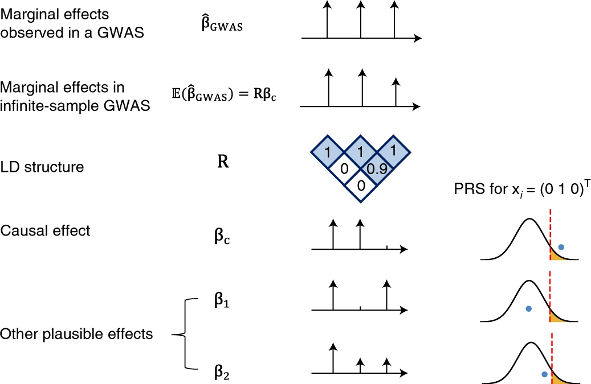
```

---

## GWAS sample size and causal effect size impact the relative ordering of marginal GWAS effects at tag versus true causal SNPs

```{r, out.height=400, out.width=600}
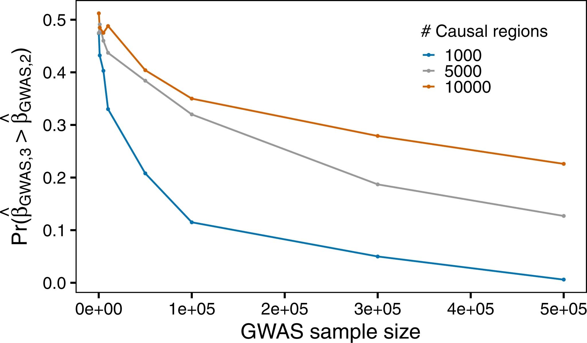
```


---

## Extracting uncertainty from Bayesian methods for probabilistic PRS-based stratification

```{r, out.height=400, out.width=600}
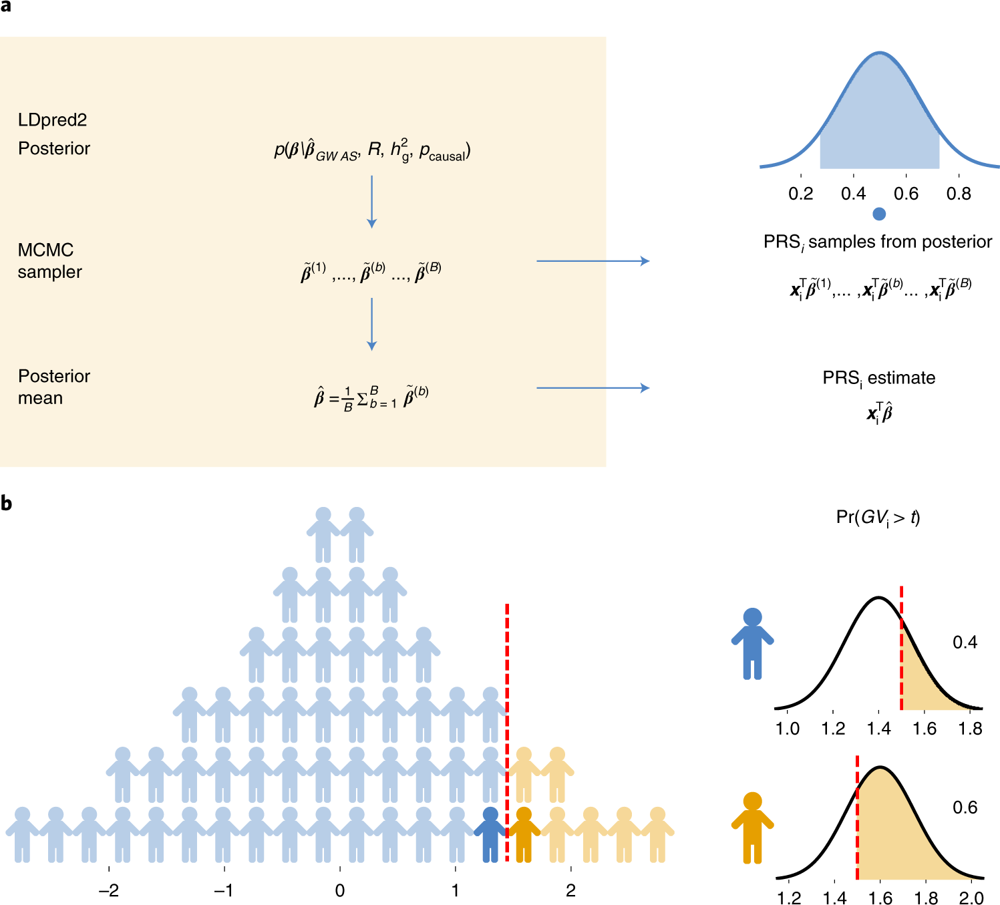
```


---

## Expected sd is highly correlated with average sd across testing subjects

.pull-left[

```{r, out.height=400, out.width=600}
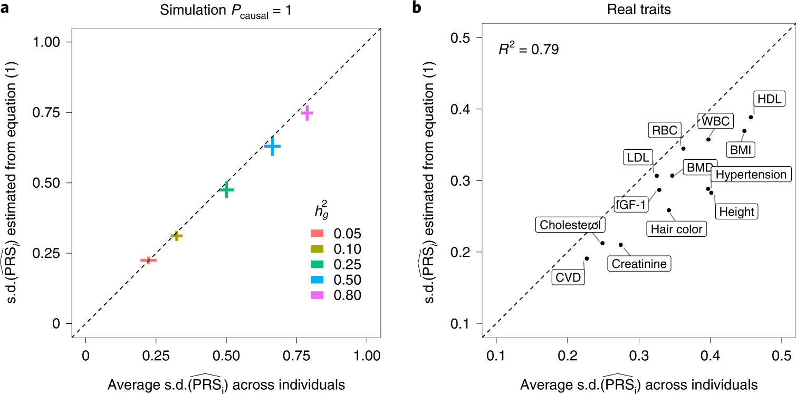
```

]

.pull-right[
$$\mathbb{E}\left(var(x_i^T\beta | D, h^2_g)\right) \approx \left(\frac{1}{h_g^2} + \frac{N}{M}\right)^{-1}$$

]


---

## Analytical estimator of sd provides approximately unbiased estimates of average sd of testing individuals

```{r, out.height=400, out.width=1100}
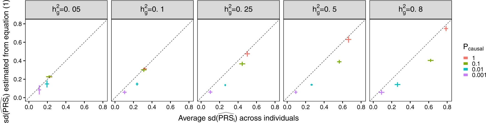
```


---

## Genetic architecture and sample size impact uncertainty in PRS estimates in simulations

.pull-left[

```{r, out.height=400, out.width=600}
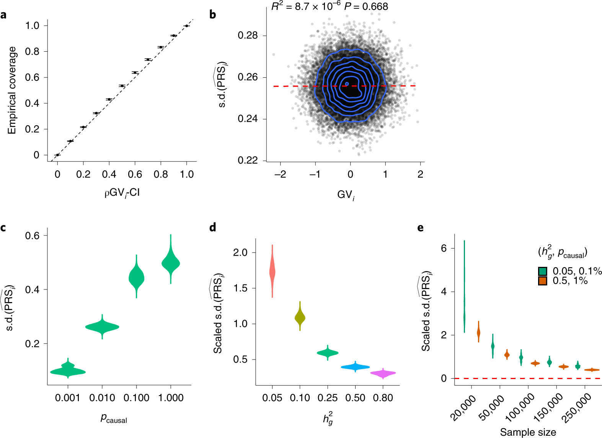
```
]


.pull-right[
$$\text{Scaled sd} = \frac{\text{sd}}{\text{sd of point estimates in the testing group}}$$
]


---

## Calibration of $\rho$-level genetic value credible interval with respect to proportion of causal effects and SNP-heritability in testing individuals

```{r, out.height=400, out.width=600}
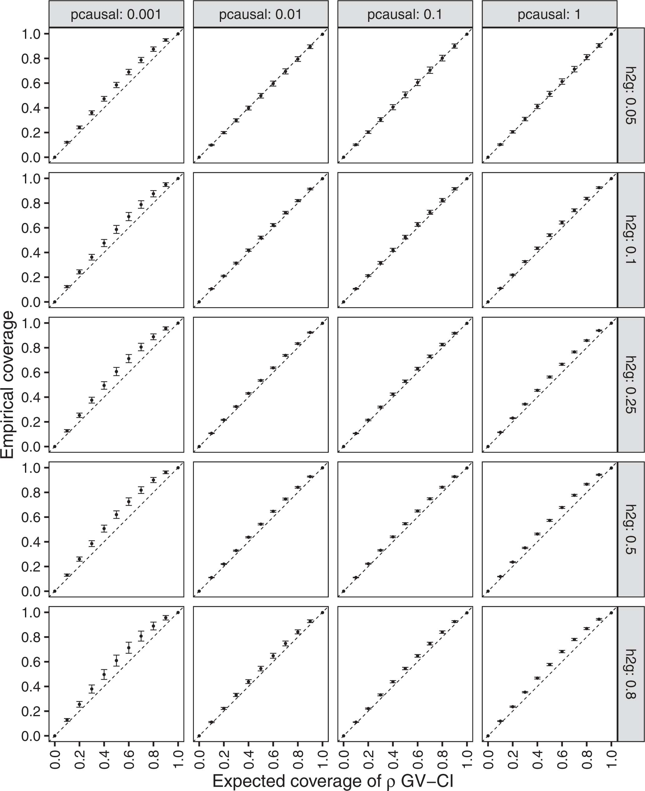
```


---

## Distribution of individual PRS absolute standard deviation with respect to polygenicity under different heritability

```{r, out.height=400, out.width=900}
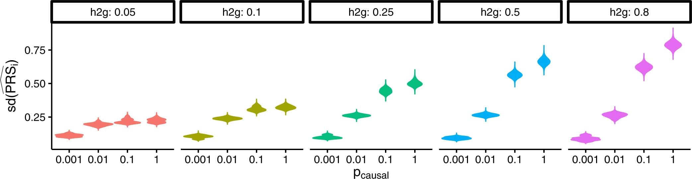
```

---

## Distribution of individual PRS absolute standard deviation with respect to heritability under different polygenicity

```{r, out.height=400, out.width=900}
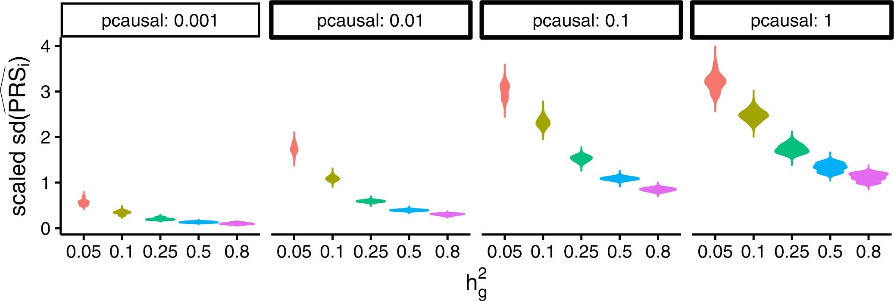
```


---

## Uncertainty in real data and its influence on PRS-based stratification

```{r, out.height=400, out.width=600}
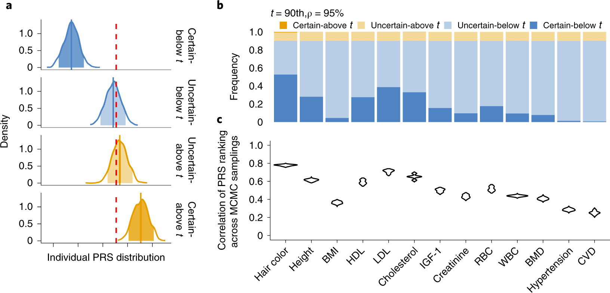
```


---

## Stratification uncertainty at different thresholds and credible set levels

```{r, out.height=400, out.width=600}
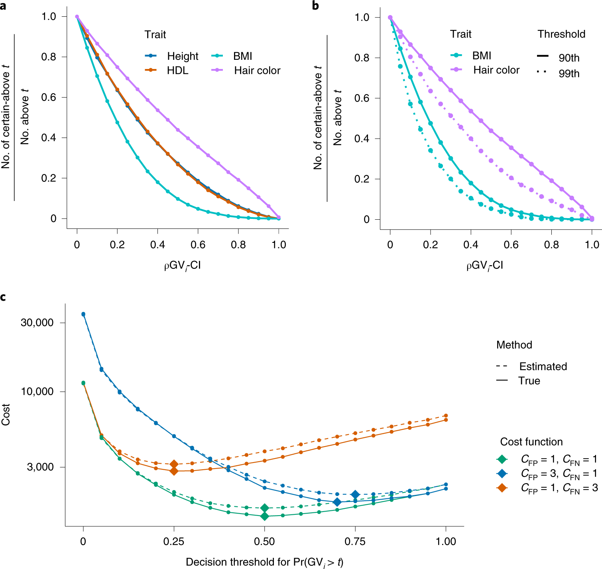
```


---

## Individual ranking is consistent when ranking by PRS estimates versus probability of genetic value above threshold

```{r, out.height=400, out.width=600}
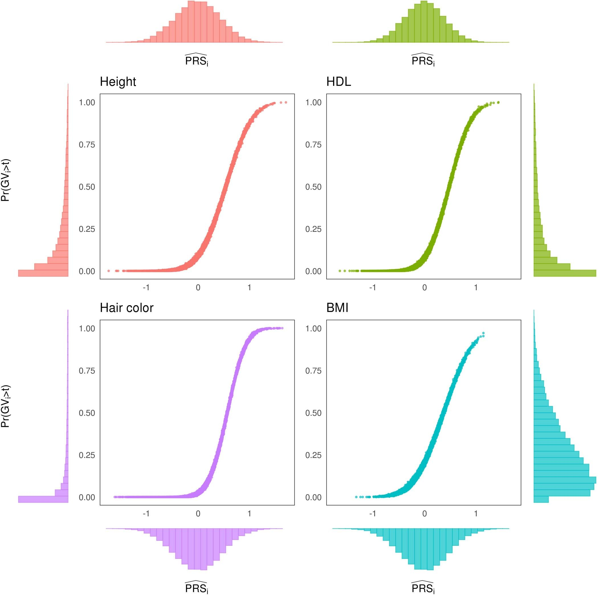
```


---

## References

```{r refs, echo=FALSE, results="asis"}
PrintBibliography(myBib)
```


