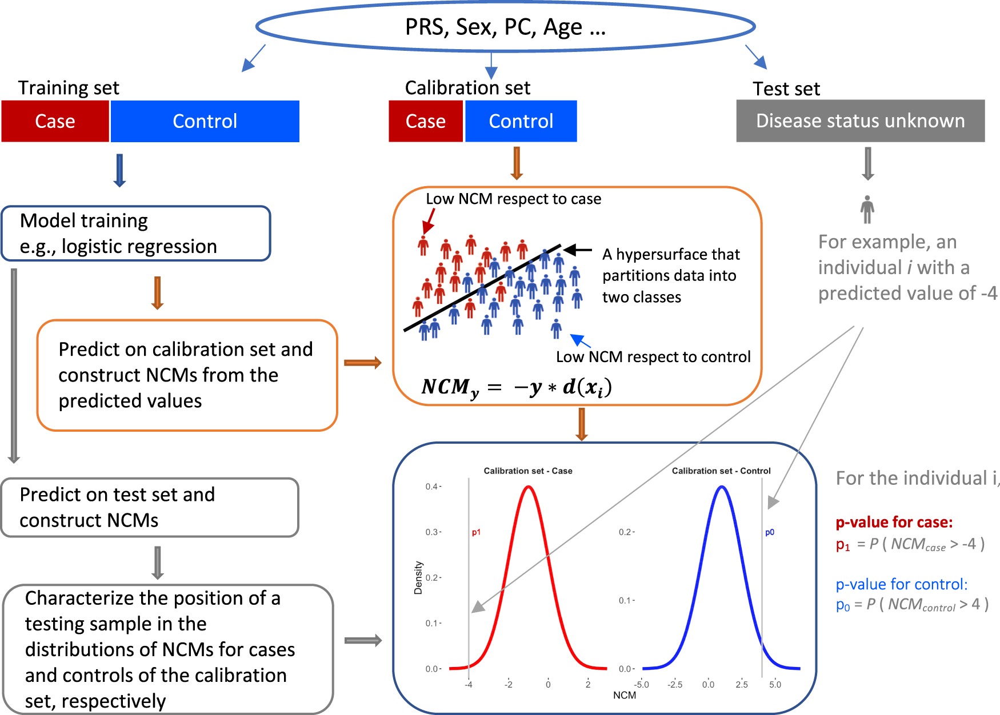
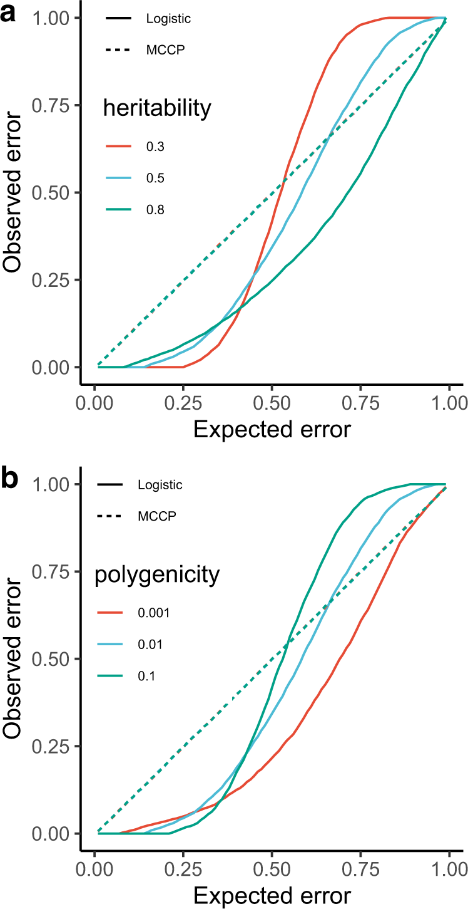
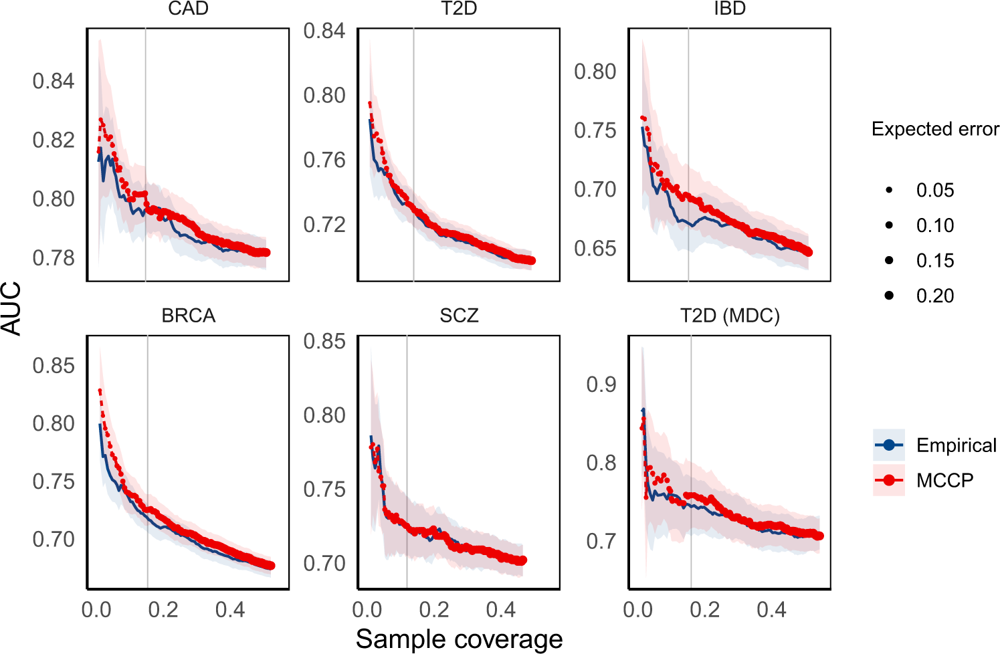
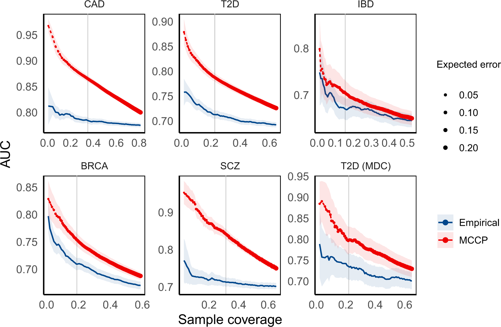

```{r setup, include=FALSE}
options(htmltools.dir.version = FALSE)
knitr::opts_chunk$set(
  fig.width=9, fig.height=3.5, fig.retina=3,
  out.width = "100%",
  cache = FALSE,
  echo = TRUE,
  message = FALSE, 
  warning = FALSE,
  hiline = TRUE
)
```

```{r xaringan-themer, include=FALSE, warning=FALSE}
library(xaringanthemer)
style_duo_accent(
  primary_color = "#1381B0",
  secondary_color = "#FF961C",
  inverse_header_color = "#FFFFFF"
)
```

## Two recent articles address prediction intervals in polygenic risk scores

1. Translating polygenic risk scores for clinical use by estimating the confidence bounds of risk prediction by Sun, et al. (Nature communications, 2021)

2. Large uncertainty in individual PRS estimation impacts PRS-based risk stratification by Ding, et al. (Biorxiv, 2021)


---

## Overview of @sun2021translating

```{r, echo = FALSE, out.height=500, out.width = 800}

```

---

class: inverse center middle

# Methods


---

## Mondrian Cross-Conformal Prediction (MCCP)

- implementation of conformal prediction in classification  
- guarantees validity of the predictor for both cases and controls  
- used to estimate confidence levels of risk prediction in a sample where disease status is known


---

## Procedure

1. Compute PRS for each subject    
1. Divided subjects into training and test sets  
1. Partition training set into $n$ equal subsets  
1. Retain one of the $n$ subsets as the "calibration set" to calculate the MCCP probability values (Eq 1) 
1. Remaining $n-1$ subsets are the "proper training set"  
1. Fit logistic regression models on the proper training set  

$$ p_y^i = \frac{| \lbrace j: y_i = y, NCM_j \ge NCM_i\rbrace |}{ N\_cal_y + 1: y_i = y}$$
- $i$ denotes subject index and $y$ denotes class - case or control  
- $N\_cal_y$ denotes number of cases (or controls) in calibration set  
- Thus, every test subject is assigned a probability of being a case and a probability of being a control  


---

## Procedure 

1. Predict on both the calibration and testing sets  
1. Calculate a nonconformity measure on every subject in the calibration and testing sets  
1. Use NCMs in calibration set assign probability values for case and control to subjects in testing set  
1. Repeat procedure $n$ times, using each of the $n$ subsets exactly once as calibration set  
1. Average the $n$ probability values for each test subject  

---

## Simulations: Design

- 10,000 subjects from iPSYCH study  
- used real genotypes on Chr 2  
- simulated case and control phenotype values 
- varied polygenicity: 0.001, 0.01, 0.1, 0.2  
- varied heritability: 0.3, 0.5, 0.8  
- varied case prevalence: 0.01, 0.05, 0.1, 0.2  
- discovery set proportion varied: 0.2, 0.5, and 0.7  
- PRS calculated with thresholding (p < 0.05) and pruning (LD $r^2 < 0.1$)  

---

## Simulations: PRS construction  

- weighted sum of effects for pruned SNPs with MAF $\ge 0.01$
- effect sizes taken from discovery GWAS or reference GWAS  

---

## Prediction outcomes 

- MCCP produces a prediction set - containing 0, 1, or 2 labels - for every test subject  
- Differs from classification approaches that produce exactly one label for every test subject  

---

## Calibration assessment  

- Reliability curves to assess calibrations by MCCP and LR  
- Divide data into five folds  
- Build MCCP and LR on four folds and make predictions on fifth fold  
- Observed error is proportion of incorrect predictions against true case-control status

$$Observed_{err}(LR) = \sum \lbrace p^i > 1 - \alpha: y = 0 || p^i < \alpha: y = 1\rbrace$$

$$Observed_{err}(MCCP) = \sum \lbrace p_y^i \le \alpha : y \rbrace$$ 

---

## Evaluation metrics 

MCCP performance measured by *validity* and *coverage*

- A prediction is valid if error frequency is less than or equal to chosen error rate $\alpha$. 

- Coverage is defined as percentage predicted as case or control  

---

class: inverse center middle

# Results 


---

## Figure 2, Simulations & Calibration plots 

```{r, echo = FALSE, out.height=500, out.width = 300}

```

.pull-right[
1.  Logistic regression underestimates error rate for small error rates & overestimates error rate for large error rates  
1. MCCP has perfectly calibrated error rates across all considered scenarios  
]


---

## MCCP vs. Empirical method in real data analysis

- Empirical method:  
    - Top $x$ proportion ( $x < 0.5$ ) are one class  
    - Bottom $x$ proportion ( $x < 0.5$ ) are second class  
- Coverage for "empirical method" $= 2x$  
- Empirical method doesn't offer individual-level prediction intervals  

---

## Figure 3, Performance with real data (PRS only)  

```{r, echo = FALSE, out.height=500, out.width = 800}

```

---

## Figure 4, Performance with real data (PRS and covariates)

```{r, echo = FALSE, out.height=400, out.width = 800}

```

---

class: inverse center middle


# Discussion 


---

## Discussion Highlights  

- MCCP risk estimates have the "validity" property: 
    - in the long run, prediction errors fall below a preset error rate  
- MCCP may aid clinicians by providing individual-level predictions  
- Future work may apply MCCP to settings where genetic and other subject-level data are available: 
    - lifestyle, SES, environmental exposures  
- Other machine learning approaches - knn, random forest, svm, deep nn - may be combined with MCCP in risk prediction  

---

## Implications for our PRS methods research  

- DBSLMM and MCCP to get prediction intervals for quantitative traits    
    - Extend MCCP from binary classification to regression setting  


---

class: center, middle

# Thanks!

Slides created via the R packages:

[**xaringan**](https://github.com/yihui/xaringan)<br>
[gadenbuie/xaringanthemer](https://github.com/gadenbuie/xaringanthemer)

The chakra comes from [remark.js](https://remarkjs.com), [**knitr**](http://yihui.name/knitr), and [R Markdown](https://rmarkdown.rstudio.com).
