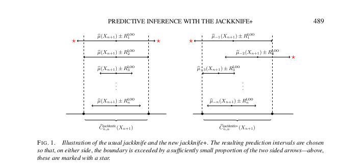

```{r setup, include=FALSE}
options(htmltools.dir.version = FALSE)
knitr::opts_chunk$set(
  fig.width=9, fig.height=3.5, fig.retina=3,
  out.width = "100%",
  cache = FALSE,
  echo = TRUE,
  message = FALSE, 
  warning = FALSE,
  hiline = TRUE
)
```

```{r xaringan-themer, include=FALSE, warning=FALSE}
library(xaringanthemer)
style_duo_accent(
  primary_color = "#1381B0",
  secondary_color = "#FF961C",
  inverse_header_color = "#FFFFFF"
)
```

```{r, load_refs, include=FALSE, cache=FALSE}
library(RefManageR)
BibOptions(check.entries = FALSE,
           bib.style = "authoryear",
           cite.style = "alphabetic",
           style = "markdown",
           hyperlink = FALSE,
           dashed = FALSE)
myBib <- ReadBib("./polygenic.bib", check = FALSE)
```


## Outline

1. Polygenic scores 
1. Prediction intervals for PGS 
1. DBSLMM 
1. Jackknife-plus for prediction intervals 


---

class: center middle


# Polygenic scores


---

## Polygenic scores

- Polygenic scores aim to summarize genetic contributions to complex traits: $$\sum_{SNPs}(\text{SNP genotype})*(\text{SNP effect})$$
- Our goal is to develop a strategy for constructing prediction intervals for PGS (quantitative or binary traits)


---

## Popular PGS methods with GWAS summary statistics

1. DBSLMM `r Citep(myBib, "yang_accurate_2020")`
1. ldpred2 
1. lassosum2 
1. SBLUP 
1. C + T


---

class: center middle


# Prediction intervals for PGS


---

## Existing approaches to prediction intervals in PRS

1. Mondrian cross-conformal prediction intervals for PRS `r Citep(myBib, "sun_translating_2021")`
  - One approach to conformal prediction 
1. Bayesian credible intervals for PRS `r Citep(myBib, "ding_large_2021")`
  - ldpred2 used to obtain posterior samples
  - Observe large variances in PRS

---

## Importance of prediction intervals for PGS

- Clinical utility of an interval estimate in addition to point estimate
- Large variability in PRS with ldpred2 
  - Method applies only to ldpred2


---

class: center middle


# DBSLMM Model & Methods

---

## DBSLMM

- All SNPs have nonzero effects on the trait  
- Each SNP effect arises from one of two normal distributions  
  - Large variance or small variance
- Treat the large variance SNP effects as fixed effects & small variance SNP effects as random effects (omnigenic hypothesis)


---

## DBSLMM Model

$$y = X\beta + \epsilon$$

- trait $y$, n vector
- $X$ n by m matrix of standardized SNP genotypes 
- $\beta$ m vector of SNP effects 
- $\epsilon$ n vector of random errors with precision $\tau$


---

## DBSLMM Model

$$y = X\beta + \epsilon$$

$$\beta_j \sim \pi N(0, \sigma^2_l\tau^{-1}) + (1 - \pi) N(0, \sigma^2_s \tau^{-1})$$
- $\pi$ proportion of SNPs in the large variance component

---

## DBSLMM Model Fitting

$$y = X\beta + \epsilon$$
- BSLMM: MCMC for model fitting is slow with large memory requirements 
- Large effect SNPs should be easy to identify from GWAS analysis 
- Small effect SNPs can't be inferred accurately 
- But polygenic effects may be inferred with accuracy 

---

## DBSLMM Model

$$y = X_l\beta_l + X_s \beta_s + \epsilon$$

- $X_l$: n by $m_l$ SNP genotypes matrix for large effect SNPs 
- $\beta_l$: $m_l$ effects vector for large effect SNPs 
- $X_s$: n by $m_s$ SNP genotypes matrix for small effect SNPs 
- $\beta_s$: $m_s$ effects vector for small effect SNPs 

$$\beta_{lj} \sim N(0, \sigma_l^2\tau^{-1})$$

$$\beta_{sj} \sim N(0, \sigma_s^2\tau^{-1})$$
- Set $\sigma^2_l \to \infty$ & treat $\beta_l$ as fixed effects 


---

## DBSLMM Model: Parameter estimation

- Clumping and Thresholding (C + T) procedure in PLINK to select large effect SNPs
  - One chromosome at a time
  - p-value threshold: $10^{-6}$ 
  - region size: 1 MB 
  - LD threshold: $r^2 = 0.1$ 
- Combine large effect SNPs across genome to get $m_l$ SNPs

---

## DBSLMM Model: Parameter estimation

$$\hat \beta_l = (X_l^TH^{-1}X_l)^{-1}X_l^TH^{-1}y$$

$$\hat \beta_s = \hat\sigma^2_s X_s^TH^{-1}( y - X_l\hat\beta_l)$$

$$Var(y) = H = \hat\sigma^2_s X_sX_s^T + I_n$$

---

## DBSLMM Model: Parameter estimation

- Set $\hat\sigma^2_s$ to predetermined value instead of estimating it  
  - LD score regression to get SNP heritability, $\hat h^2$
  - Set $\hat \sigma^2_s = \frac{\hat h^2}{m}$
  
  
---

## DBSLMM Model: Parameter estimation

- Use Woodbury matrix identity to calculate $H^{-1}$

$$H^{-1} = I_n - X_s(\sigma_s^{-2}I_{m_s} + X_s^TX_s)^{-1}X_s^T$$


---

class: center middle

# Prediction intervals for PGS

---

## Jackknife-plus for prediction intervals `r Citep(myBib, "barber_predictive_2020")`

- Uses ideas and results from conformal prediction theory 
- Comes with probabilistic coverage guarantees 
- Assumes exchangeability of observations 
- Uses leave-one-out residuals 

---

## Jackknife-plus for prediction intervals `r Citep(myBib, "barber_predictive_2020")`


- JK+ constructs prediction interval for $Y_{n+1}$ as a function of $n$ training points $(X_i, Y_i)$ & $X_{n+1}$
Naively, we might want to use residuals from the training data to construct the interval:
$$(X_{n+1}) \pm (\text{the }(1- \alpha)\text{ quantile of the }n\text{ absolute residuals})$$
Residuals are $|Y_1 - \hat\mu(X_1)|, …, |Y_n - \hat\mu(X_n)|$ 
Due to overfitting, $n$ training residuals tend to be smaller than that of the $(n+1)^{th}$ point

---

## Jackknife-plus for prediction intervals `r Citep(myBib, "barber_predictive_2020")`

- JK computes leave-one-out residuals:
  - $R_i = |Y_i - \hat\mu_{-i}(X_i)|$  
- And computes the regression function $\hat\mu$ with all $n$ training points  
- And outputs the interval:  
  - $\hat\mu(X_{n + 1}) \pm (\text{the } (1 - \alpha) \text{ quantile of } R_1, \ldots, R_n)$  
- `r Cite(myBib, "barber_predictive_2020")` point out that JK has no universal theoretical guarantees & may lose predictive coverage in some settings  
  
---

## Jackknife-plus for prediction intervals `r Citep(myBib, "barber_predictive_2020")`

- JK+ is a modification of JK  
  - Replace $\hat\mu$ with $\hat\mu_{-i}$ 


---

## Jackknife-plus for prediction intervals `r Citep(myBib, "barber_predictive_2020")`

- Notation  
  - $\hat q_{n, \alpha}^+\lbrace v_i\rbrace = \text{the }\lceil(1-\alpha)(n + 1)\rceil\text{-th smallest value of }v_1, \ldots v_n$ 
  - $\hat q_{n, \alpha}^-\lbrace v_i\rbrace = \text{the }\lfloor\alpha(n + 1)\rfloor\text{-th smallest value of }v_1, \ldots v_n$  

---

## Jackknife-plus for prediction intervals `r Citep(myBib, "barber_predictive_2020")`

- $\hat C_{n, \alpha}^{\text{naive}}(X_{n + 1}) = \hat\mu(X_{n + 1}) \pm \hat q_{n, \alpha}^+\lbrace |Y_1 - \hat\mu(X_1)|, \ldots, |Y_n - \hat\mu(X_n)|\rbrace$  
- $\hat C_{n, \alpha}^{\text{JK}}(X_{n + 1}) =  \left(\hat q_{n, \alpha}^-\lbrace \hat\mu(X_{n + 1}) - R_i^{LOO}\rbrace, \hat q_{n, \alpha}^+\lbrace \hat\mu(X_{n + 1}) + R_i^{LOO}\rbrace\right)$  
- $\hat C_{n, \alpha}^{\text{JK+}}(X_{n + 1}) =  \left(\hat q_{n, \alpha}^-\lbrace \hat\mu_{- i}(X_{n + 1}) - R_i^{LOO}\rbrace, \hat q_{n, \alpha}^+\lbrace \hat\mu_{-i}(X_{n + 1}) + R_i^{LOO}\rbrace\right)$  


---

## Jackknife-plus for prediction intervals `r Citep(myBib, "barber_predictive_2020")`


```{r, echo = FALSE, out.height=400, out.width = 500}

```


---

## Cross-validation+


---

class: center middle

# Thank you!

---

## References

```{r refs, echo=FALSE, results="asis"}
PrintBibliography(myBib)
```


